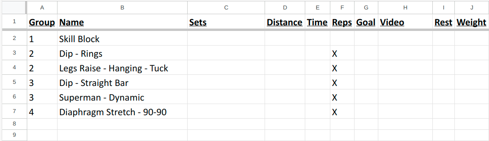
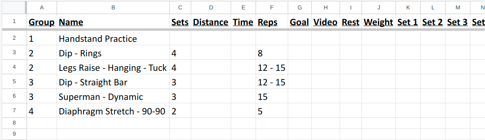

# wodgen

`wodgen` is a Rust-based command-line application that drafts my daily workouts based on specified exercise types, difficulty level, and other parameters. The program reads exercises from CSV files, filters them based on the provided criteria, and outputs a workout plan in CSV format.

## Features

- Supports multiple exercise types: Cooldown, Core, Legs, Pull, Push.
- Allows specifying the difficulty level: Beginner, Intermediate, Advanced.
- Defaults to including bodyweight-only exercises.
- Generates a draft workout plan with a specified number of super-sets.
- Includes a cooldown exercise at the end of the workout.
- Snoozes selected exercises for 7 days to avoid repetition in the next few workouts.

## Usage

Run the program with the desired options:

```sh
./wodgen [OPTIONS]
```

### Options

- `-t, --types <TYPES>`: Exercise types to include in the workout (e.g., core, legs, pull, push). This option is required and can accept multiple values.
- `-g, --groups <GROUPS>`: Number of super-sets to include in the workout. Default is 2.
- `-l, --level <LEVEL>`: Level of difficulty for the workout (beginner, intermediate, advanced). Default is intermediate.
- `-e, --exercise-library-dir <EXERCISE_LIBRARY_DIR>`: Path to the exercise library directory. Default is `./exercise_library`.
- `-w, --workouts-dir <WORKOUTS_DIR>`: Path to the directory where the workouts are saved. Default is `./workouts`.
- `-b, --bodyweight <BODYWEIGHT>`: Whether to include only bodyweight exercises in the workout. Default is true.

### Example

```sh
./wodgen -t push core
```

This command drafts a workout plan that includes push and core exercises, with 2 super-sets, at the intermediate level.

Draft workout:


After a few edits:


## CSV File Format

### Exercise CSV

The exercise CSV files should have the following columns:

- `name`: Name of the exercise.
- `exercise_type`: Type of the exercise (Cooldown, Core, Legs, Pull, Push).
- `exercise_category`: Category of the exercise (Primary, Secondary, Accessory).
- `exercise_level`: Level of the exercise (Beginner, Intermediate, Advanced).
- `exercise_programming`: Programming type of the exercise (Distance, Reps, Time).
- `bodyweight`: Whether the exercise is bodyweight (true/false).
- `goal`: Goal of the exercise (optional).
- `video`: Path to a video demonstrating the exercise.

### Snoozed Exercises CSV

The snoozed exercises CSV file should have the following columns:

- `name`: Name of the snoozed exercise.
- `timestamp`: Timestamp when the exercise was snoozed.

## Rep Scheme Guide

- Pyramid: 2 - 4 - 6 - 8 - 6 - 4 - 2
- Reverse Pyramid: 8 - 6 - 4 - 2
- Straight: 8 - 8 - 8
- Ladder: 1 - 2 - 3 - 4 - 5 - 4 - 3 - 2 - 1
- Descending Ladder: 5 - 4 - 3 - 2 - 1
- Ascending Ladder: 1 - 2 - 3 - 4 - 5
- Time-Based Ladder: instead of counting reps, you can base the ladder on time, 20s - 30s - 40s - 50s - 60s for example
- Superset: perform two exercises back to back with no rest in between
- Dropset: perform a set to failure, then reduce the weight/intensity and perform another set to failure
- Rest-Pause: this involves performing a set to failure, then resting for a short period before performing another set to failure, Set 1 - Rest - Set 2
- Tri-Set: perform three different exercises back-to-back with no rest in between
- Giant Set: perform four or more exercises back-to-back with no rest in between
- AMRAP: as many reps as possible in a set period
- EMOM: set number of reps every minute

## License

This project is licensed under the MIT License. See the [LICENSE](LICENSE) file for details.

## Acknowledgements

This project relies on the following Rust crates:

- `clap`
- `rand`
- `chrono`
- `serde`
- `serde_derive`
- `csv`
- `anyhow`
- `log`
- `simplelog`
- `assert_cmd`
- `predicates`
- `pretty_assertions`
